# 记一次xjb破解软件

## 0x00

首先，把[软件](http://www.amplesound.net/)下下来发现需要注册 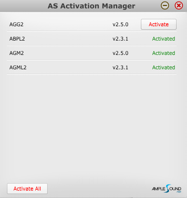

还有离线激活的入口 ，嗯，说明有戏。 ~~主要是学生党买不起~~ 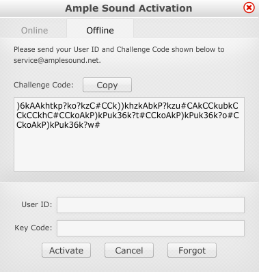

## 0x01

查壳，无壳

随便操作一下找到关键字 `Sorry, this is an invalid Key Code.`

丢进OD搜一波字符 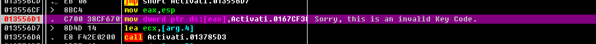

找到后点进去下断，跑起来。

停在断点，发现栈里有我们输入的内容，看来就是这儿了 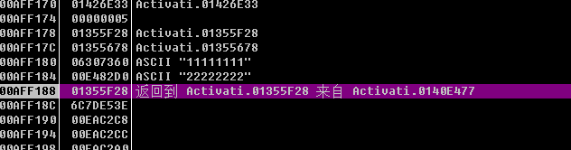

慢慢跟，到函数返回，在这儿，就在 `call` 之前下断，再跑一次 

进到 `call` 里，找到关键跳，说明校验的函数在上面 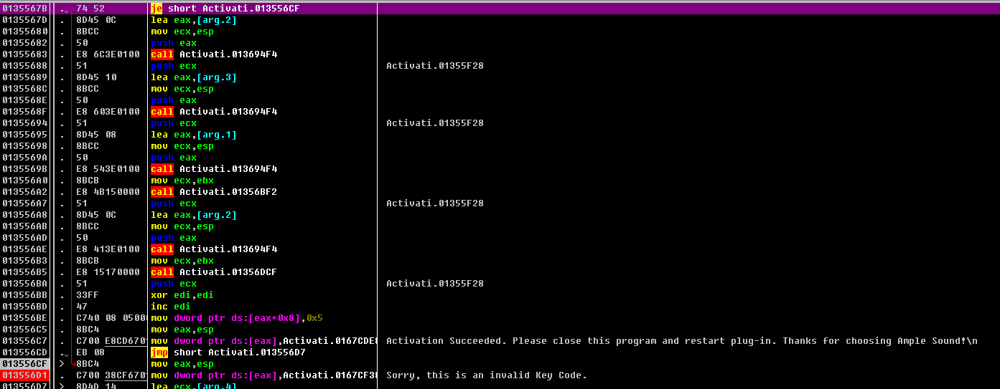

然后就在这前面的 `call` 里慢慢找，找到一个好像是计算md5的  。跟进去看看。 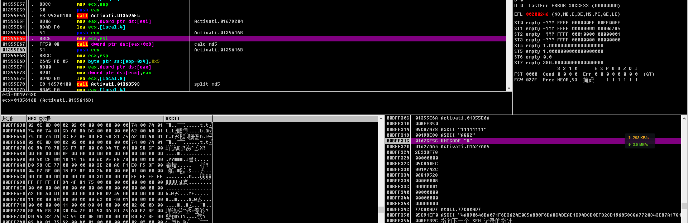

发现里面有一些奇怪的字符串 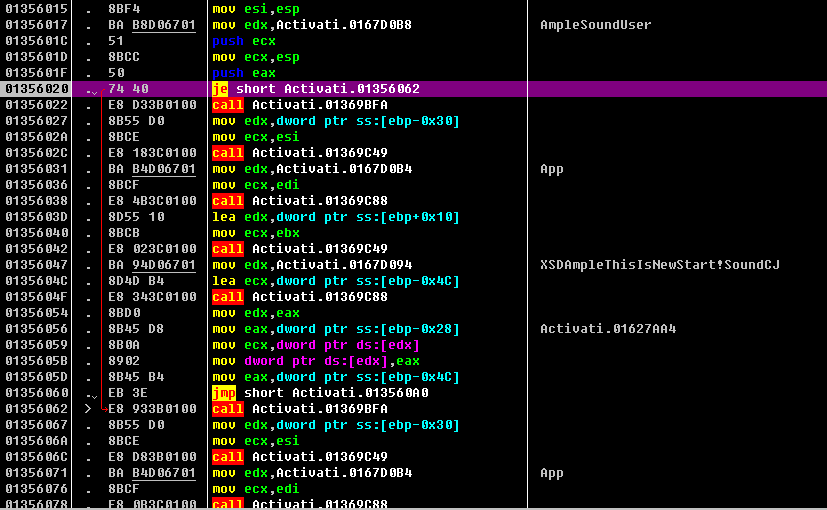

以及 `challenge code` 的一部分，似乎是按 `#` 分隔的。同时，在栈中多次出现 `#` ，所以猜测 `#` 是分隔符。

通过一堆操作，似乎连成了一个字符串。记得经常下断，避免程序跑飞了就不知道调到哪儿了。然后就能看出来拼出的字符串是 `AmpleSoundUser+uid+code_part_x+App+software+AmpleThisIsNewStart!Sound+WindowsIsStable`  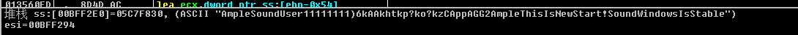

在这一步过后出现了一个长度为32的字符串，第一感觉， `md5` ，找个 [md5加解密网站](http://www.cmd5.com/) 加密一下那串字符，发现那个32位的字符串就是 `md5` 。 然后再把 `md5` 结果大写，连上 `#`。 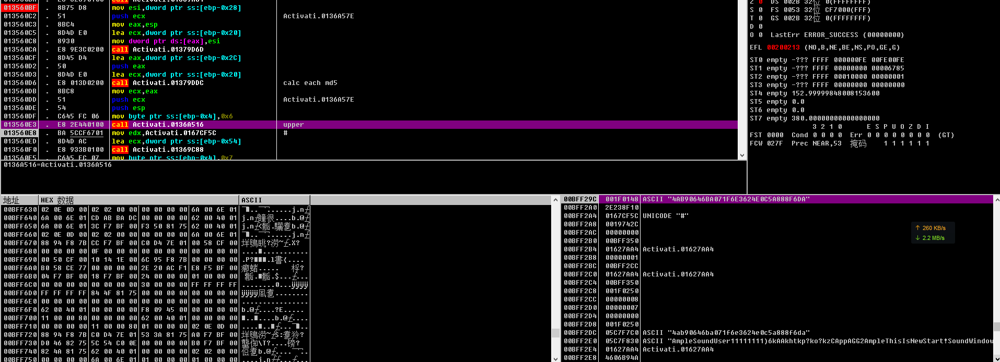

然后下面就是一堆 `free` 销毁数据（全部变 `铪` 了。。。），跳回去继续跑。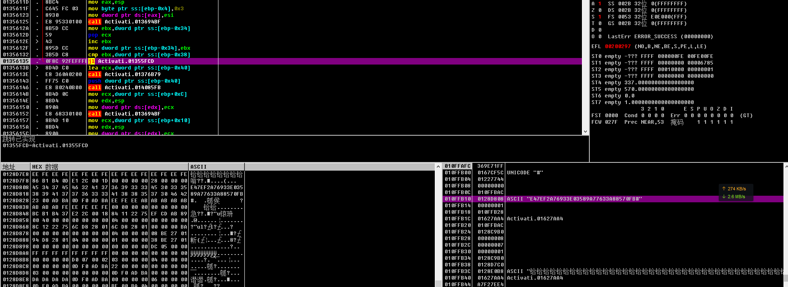

出了循环，一堆用 `#` 隔开的 `md5` 就能在堆中找到。

继续跟， `calc md5` 函数返回，发现下面会将计算的 `md5` 分开存放，然后把之前的 `free` 掉。一言不合就 `free` ，好气啊。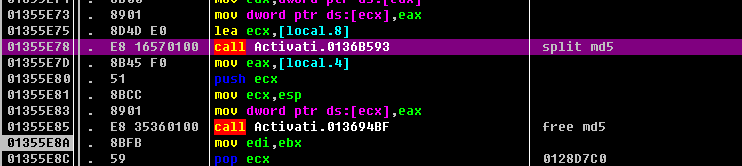

下面有个循环，比较 `key` 和 `md5` 的，由此猜测， `key` 就是 `md5` 。 将 `z` 标记置0，发现果然通过了。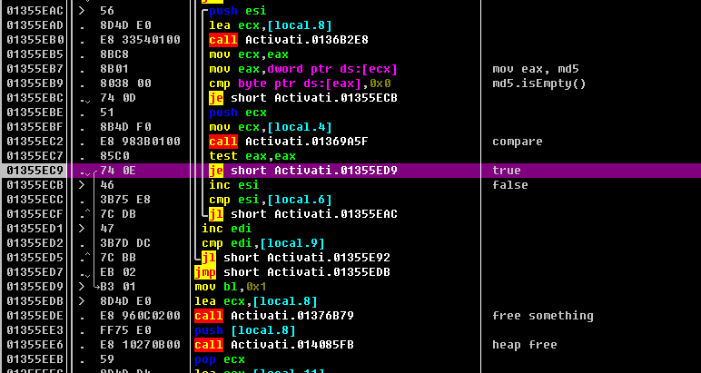

其实之前运气好直接把那一串 `md5` 丢进 `key` ，然后程序在分割 `challenge code` 之前对 `key` 也进行了分割。然后对分割的结果相互比较，有一个相同就成功。

## 0x02

所以，整个过程就是：

- 拿到 `key` ，分割，存放
- 拿到 `uid` ，获取软件缩写，获取 `challenge code` ，与内置的盐进行拼接
- 通过运算，得出多个 `md5` ，再分割存放
- 每个 `md5` 与每个 `key` 进行比较
- 有相同则通过

所以注册机中任意一个 `md5` 都可以作为 `key` 。 

## 0x03

疑问：

- 为什么要这么多段，还每一段都有效
- `AmpleThisIsNewStart!Sound` 和 `XSDAmpleThisIsNewStart!SoundCJ` 这两个盐，但是我的两个产品都只用到了第一个。看那个跳转虽然是 `je` ，但是前面根本没有改变条件寄存器。

## 0x04

总结：

- 其实过程中不止用了 `OD` ，还丢进 `IDA` 研究了一番，大概流程也是在 `IDA` 中分析的，现在是再走一遍，思路清晰，很快就找到了那些地方。所以最好还是多个工具结合使用。
- 逆向是个枯燥的过程，你要在一堆汇编代码或者伪代码或者流程图中漫游，找到那些程序运行的轨迹，再在不同轨迹间随意切换，最终找到自己想要的那条。
- 勤能补拙。高手可能花几个小时就搞定了，我却要花一天，但是我们所达到的结果是一样的，不是吗？
